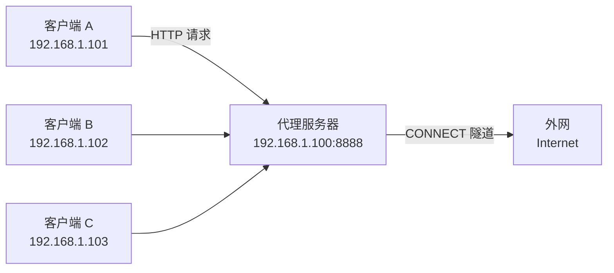

最近办公室来了几台新机器，只有一台连着外网，剩下的只能老老实实待在内网里。每次要在没网的机器上装个包、拉个代码，都得先传到有网的那台再 scp 过去，折腾。

让有网的机器当 HTTP 代理，没网的机器配好环境变量就能直接访问外网——这才是省心的做法。

本文适合**刚接触 Linux 网络配置、需要快速解决局域网代理问题的开发者**。读完你能：在一台 Linux 机器上用 Tinyproxy 搭建 HTTP 代理，并在其他机器上配置客户端通过它上网。

## 场景



有网的机器当网关，没网的机器把 HTTP/HTTPS 请求统统转发给它。

Tinyproxy 够轻量，资源占用极低，配置也简单，适合这种场景。Squid 功能虽强但太重了，这里用不上。

## 安装

在有网的那台机器上：

```bash
# Debian / Ubuntu
sudo apt install tinyproxy

# RHEL / CentOS / Rocky
sudo yum install tinyproxy
```

## 配置

编辑 `/etc/tinyproxy/tinyproxy.conf`：

### 允许局域网访问

默认只允许本机访问。找到 `Allow 127.0.0.1`，注释掉，改成你的网段：

```ini
# Allow 127.0.0.1
Allow 192.168.1.0/24
```

不确定网段的话，可以直接注释掉所有 `Allow` 行——不过局域网里限制一下更安心。

### 端口

默认 `8888`，不改也行：

```ini
Port 8888
```

### 关掉 Via 头

Tinyproxy 默认会往请求里插 `Via` 头，局域网内部用没必要，关掉省心：

```ini
DisableViaHeader Yes
```

## 启动

```bash
sudo systemctl enable tinyproxy
sudo systemctl restart tinyproxy
sudo systemctl status tinyproxy
```

确认端口在监听：

```bash
ss -tlnp | grep 8888
```

## 客户端配置

### 临时用（当前终端）

```bash
export http_proxy=http://192.168.1.100:8888
export https_proxy=http://192.168.1.100:8888
```

### 写进 shell 配置

丢到 `~/.bashrc` 或 `~/.zshrc`：

```bash
export http_proxy=http://192.168.1.100:8888
export https_proxy=http://192.168.1.100:8888
export no_proxy=localhost,127.0.0.1,10.0.0.0/8
```

然后 `source ~/.bashrc`。

### apt 也要走代理

创建 `/etc/apt/apt.conf.d/proxy.conf`：

```ini
Acquire::http::Proxy "http://192.168.1.100:8888";
Acquire::https::Proxy "http://192.168.1.100:8888";
```

### 验证

没网的机器上跑一下：

```bash
curl -I https://www.google.com
```

能返回 HTTP 状态码就成了。

## 常见陷阱

- **防火墙没放行端口**：检查代理机器的 `iptables` 或 `ufw` 是否允许 8888 端口入站。Tinyproxy 配置好了但客户端连不上，多半是防火墙的问题。
- **Allow 规则写错了网段**：客户端 IP 不在允许范围内会直接被拒绝。可以在日志里确认——`tail -f /var/log/tinyproxy/tinyproxy.log` 会显示拒绝记录。
- **环境变量只对当前 shell 生效**：用 `export` 配完要 source 一下，或者确认确实写进了 shell 配置文件。新开的终端别忘了重载。

## 几点说明

- Tinyproxy 只支持 HTTP/HTTPS，不支持 SOCKS5。要用 SOCKS 的话可以上 Dante 或者直接 ssh 隧道。
- HTTPS 走的是 CONNECT 隧道，Tinyproxy 只透传不解析，所以不用担心中间人问题。
- 默认不限制连接数，人多了可以调 `MaxClients` 和 `MaxRequestsPerChild`。

## 参考

- [Tinyproxy 官方文档](https://tinyproxy.github.io/)