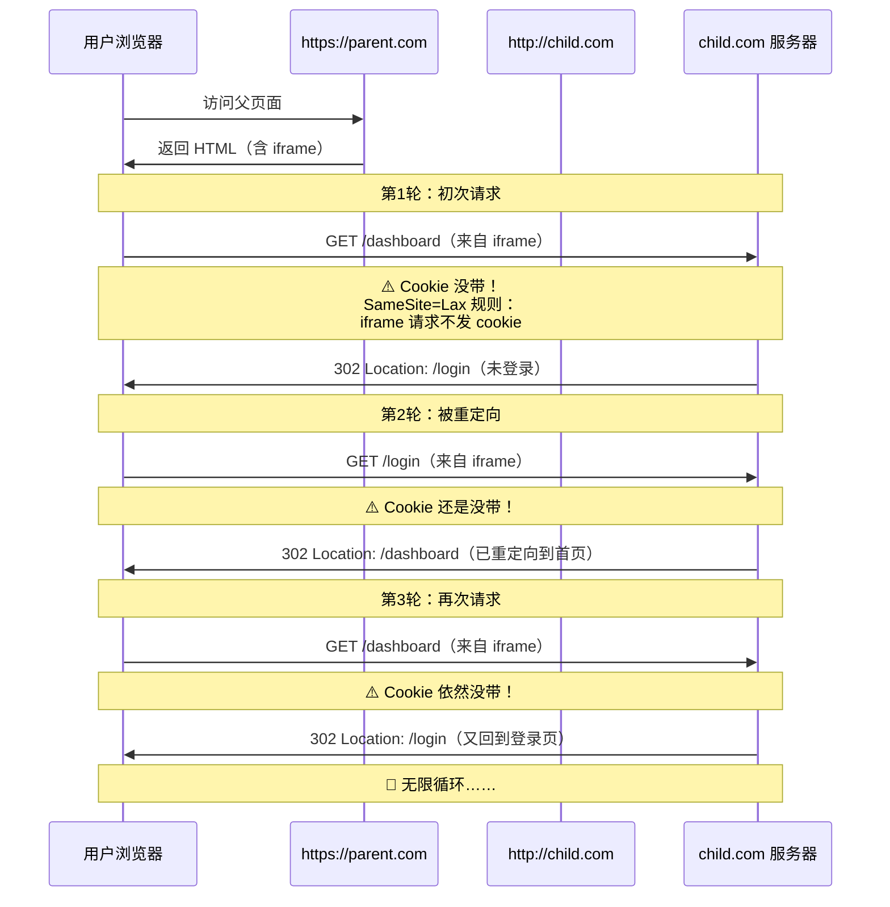

## 先看现象

你有这么一个页面：

```html
<!-- https://parent.com （父页面，HTTPS） -->
<iframe src="http://child.com/dashboard"></iframe>
```

父页面是 HTTPS，通过 iframe 嵌入了一个 HTTP 的子页面。

结果呢？iframe 区域一片空白，或者一直在转圈。

打开浏览器开发者工具 → Network 面板，你看到的是这样：

```
http://child.com/dashboard
  → 302 Location: /login
  → 302 Location: /login
  → 302 Location: /login
  → 302 Location: /login
  ……
```

无限 302 重定向，永远不会停下来。

如果你直接在浏览器中打开 `http://child.com/dashboard`（不通过 iframe），又一切正常。

问题出在哪？

## 先猜一下：是 Cookie 没送过去

子页面 `/dashboard` 需要用户登录。浏览器之前已经登录过 `child.com`，cookie 里保存了 session ID。

但当这个页面被嵌入 iframe 时，服务器每次都说"你没登录，去登录页"。

凭什么？

我们把 `child.com` 服务器的响应头拿出来看一下：

```
Set-Cookie: session_id=abc123; Path=/; SameSite=Lax
```

注意到 `SameSite=Lax` 了吗？

这就是罪魁祸首。

## SameSite 是什么？

SameSite 是 Cookie 的一个安全属性。它控制着 cookie 在"跨站请求"中要不要一起发送。

它有三个值：

| 值 | 行为 |
|---|---|
| `Strict` | 任何跨站请求都不发 cookie（最严格） |
| `Lax` | **顶层导航**（用户点击链接、地址栏输入）才发；iframe、图片、script 等"嵌入"请求不发 |
| `None` | 所有跨站请求都发（但必须配合 `Secure`，即仅在 HTTPS 下使用） |

从 Chrome 80 开始（2020年），**如果没有设置 SameSite，默认就是 Lax**。

问题就在 `Lax` 的规则里——它说"iframe 里的请求不发"。

## Mermaid 时序图：一步步追踪重定向过程

下面是完整的请求链路。一张图看清全过程：



**关键点**：因为 SameSite=Lax 的规则，cookie **自始至终没有被发送**。服务器每次收到请求，都认为这是一个未登录用户，于是不断下发 302 重定向。

## 为什么 SameSite Lax 要这么设计？

你可能想问：**为什么浏览器要做这种"不送 cookie"的蠢事？**

不是蠢，是为了安全。

举个例子：假设你登录了银行网站 `https://bank.com`，然后你访问了一个恶意网站 `https://evil.com`。恶意网站通过 iframe 嵌入了 `http://bank.com/transfer?to=hacker&amount=10000`。

如果没有 SameSite 限制，这个 iframe 请求会把你的银行 cookie 一起发送——服务器看到合法的 session id，就真的转账了。这就是经典的 **CSRF（跨站请求伪造）** 攻击。

SameSite=Lax 的设计目的就是：**在 iframe、img、script 等"嵌入"的跨站请求中，不发 cookie，从源头阻止 CSRF**。

所以 SameSite 不是 bug，是 feature。你遇到的问题是**这个安全 feature 在你特定的场景下产生的副作用**。

## 更深一层：HTTP 和 HTTPS 混用的问题

你的父页面是 HTTPS，子页面是 HTTP。

这也加剧了问题。

现代浏览器对 **"安全上下文（HTTPS）嵌入非安全上下文（HTTP）"** 持谨慎态度。很多浏览器会限制 HTTP iframe 获取 cookie 的能力，即使 SameSite 设置正确，也可能出现不可预期的行为。

Chrome 的策略是：

> 如果父页面是 HTTPS，子 iframe 是 HTTP，那么这个 iframe **不会被视为安全的上下文**。某些 cookie 相关的行为会被限制。

所以这是两重打击叠加：
1. **SameSite=Lax** → iframe 跨站请求不发 cookie
2. **HTTPS → HTTP 混用** → 浏览器对 HTTP iframe 的 cookie 访问施加额外限制

## 怎么解决？

假设子页面 `child.com` 的服务器在你手里。以下方案从推荐到不推荐排列：

### 方案 A：把子页面也改成 HTTPS ✅

```html
<!-- https://parent.com -->
<iframe src="https://child.com/dashboard"></iframe>
```

最直接、最彻底的方案。

HTTPS iframe 嵌入 HTTPS 父页面，浏览器不认为这是跨站混用。SameSite=Lax 在**同站跨 HTTPS 请求中正常发送**（因为 `parent.com` 和 `child.com` 是不同域名）。

> 注意：这里说的"跨站"是域名级别。如果你的父页面和子页面在同一个注册域名下（比如 `parent.example.com` 和 `child.example.com`），则属于"同站"，SameSite=Lax 是**会发送 cookie 的**。

### 方案 B：把 SameSite 改成 None + Secure

```javascript
// 设置 cookie 时
Set-Cookie: session_id=abc123; SameSite=None; Secure; Path=/
```

`SameSite=None` 允许所有跨站请求携带 cookie。但要求：
- 必须同时设置 `Secure`（即 cookie 只在 HTTPS 下传输）
- **子页面也必须升级到 HTTPS**（因为 `Secure` 要求 HTTPS）

所以方案 B 的前提和方案 A 一样：需要 HTTPS。

### 方案 C：父页面通过 postMessage + 顶层导航传递认证

如果实在改不了 HTTPS（比如子页面运行在只有 HTTP 的内部环境）：

```javascript
// 父页面（https://parent.com）
const iframe = document.getElementById('child-iframe');
iframe.contentWindow.postMessage({
  type: 'auth',
  token: 'bearer_token_here'
}, '*');
```

```javascript
// 子页面（http://child.com）
window.addEventListener('message', (event) => {
  if (event.data.type === 'auth') {
    // 把 token 存到 localStorage 或内存中
    localStorage.setItem('auth_token', event.data.token);
    // 然后手动重定向到目标页
    window.location.href = '/dashboard';
  }
});
```

但这么做有个安全风险：`postMessage` 到 `*`（不检查来源）可能被任意页面拦截。生产环境一定要验证 `event.origin`。

### 方案 D：父页面用代理 iframe

在你的 HTTPS 服务器上创建一个同源的代理页面：

```html
<!-- https://parent.com/proxy?target=http://child.com/dashboard -->
<!-- 这个页面通过后端代理获取 HTTP 子页面的内容 -->
<iframe src="https://parent.com/proxy?target=http://child.com/dashboard"></iframe>
```

后端实现（以 Express.js 为例）：

```javascript
app.get('/proxy', async (req, res) => {
  const target = req.query.target;
  // ⚠️ 注意做 URL 白名单验证，防止 SSRF
  const response = await fetch(target);
  const html = await response.text();
  res.send(html);
});
```

这样 iframe 是 HTTPS 且同源的，cookie 问题不存在。但缺点很明显：**子页面的所有资源链接（CSS、JS、图片）都需要重写**，而且无法处理子页面的重定向。

## 调试技巧

如果你遇到了这种问题，以下步骤可以快速定位：

**第一步：打开开发者工具 → Network 面板**
看请求链是不是全是 302。如果是，怀疑 cookie 问题。

**第二步：检查 Application → Cookies**
看子域名的 cookie 有没有被发送。如果在请求头（Request Headers）里看不到 `Cookie`，说明 cookie 没带上。

**第三步：检查 cookie 的 SameSite 属性**
在 Application → Cookies 面板中，找到 `SameSite` 列。如果是 `Lax` 或 `Strict`，在 iframe 场景下不会发送。

**第四步：检查协议**
看一眼地址栏和 iframe 的 `src` 协议是否一致。HTTP 和 HTTPS 混用经常带来意外问题。

## 总结

| 问题 | 原因 | 解决方案 |
|---|---|---|
| iframe 无限重定向 | SameSite=Lax 在 iframe 请求中不发 cookie | 升级子页面到 HTTPS |
| HTTPS 嵌入 HTTP | 浏览器限制混合内容的 cookie 访问 | 统一 HTTPS |
| SameSite 设计意图 | 防 CSRF 攻击 | 理解安全设计，不要绕过它 |

一句话总结：

**父页面和子页面都统一用 HTTPS，SameSite 保持默认（Lax），就没有问题。**

如果你必须用 HTTP，那就只能用 postMessage 或代理方案绕过去——但最好的路永远是：全部 HTTPS。